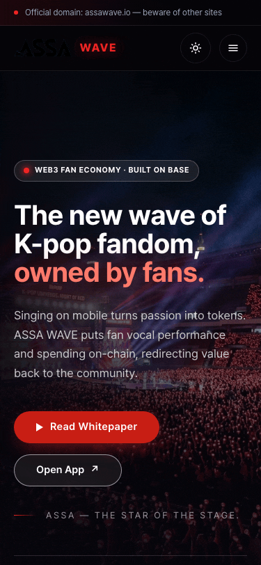

# ASSA WAVE

> A Web3 fan economy for K-pop — fan participation turned into on-chain value, built on Base.

<p align="center">
  
  <br/>
  <sub>Site mobile navigation — <a href="https://assawave.io">assawave.io</a></sub>
</p>

**Live:** [assawave.io](https://assawave.io) (marketing site) · [app.assawave.io](https://app.assawave.io) (investor portal)

## Overview

ASSA WAVE turns K-pop fandom activity into on-chain value and redirects it back to the community through the **$ASSA** token. The token coordinates three engines — fan vocal performance (sing-to-earn), ecosystem spending, and edge-node operation — on **Base** (an Ethereum L2).

This repository is a monorepo: the smart contracts, the marketing site, and the investor portal live side by side.

## Structure

```
assawave/
├── onchain/   # Solidity contracts + Hardhat suite (Base mainnet / Base Sepolia)
├── site/      # Marketing site  — Vite + React + Tailwind            (→ assawave.io)
├── portal/    # Investor portal — Vite + React + Tailwind + wagmi/RainbowKit (→ app.assawave.io)
└── docs/      # Specs, design docs, and assets
```

## Smart contracts (`onchain/`)

Phase-1 suite — Solidity 0.8.24, OpenZeppelin v5, Hardhat, ethers v6:

| Contract | Purpose |
|----------|---------|
| `ASSAToken` | $ASSA — hard-capped ERC-20 with Permit, Votes, and Burnable extensions |
| `StakingLock` | veASSA — non-transferable, zero-yield lock with linear voting-power decay and VIP tiers |
| `TokenVesting` | TGE + cliff + linear vesting schedules, id-indexed per beneficiary |
| `TokenSale` | Round-based USDC purchase with self-vesting allocations |
| `KYCRegistry` | Standalone, role-gated KYC allowlist |
| `Treasury` | Role-gated vault with per-bucket release accounting |
| `BMEBurner` | Burn-and-Make — routes USDC revenue to buy back and burn $ASSA |
| `ASSATimelock` | OpenZeppelin `TimelockController` governing the suite (48h delay floor enforced on mainnet) |

`npm test` → **52 passing**. Governance is exercised end-to-end (Safe multisig → Timelock → execute) and a full live user scenario runs against the testnet via scripts under `onchain/scripts/`.

## Getting started

Each package is a standalone npm project (Node 18+). Install and run the one you need.

**Marketing site**
```bash
cd site && npm install && npm run dev      # http://localhost:5173
```

**Investor portal**
```bash
cd portal && npm install && npm run dev
```

**Contracts**
```bash
cd onchain && npm install
npm test            # run the Hardhat test suite
npm run coverage    # coverage report
```

The frontends read wallet/RPC config from a local `.env` per package; contract deploys read keys and RPC URLs from `onchain/.env`. Never commit secrets — `.env` files are gitignored.

## Deployment

- **Site & portal** deploy to Cloudflare Pages: `npm run deploy` in `site/` (project `assawave-site`) and in `portal/` (project `assawave-portal`).
- **Contracts** are live on **Base Sepolia** (testnet, chain `84532`): `cd onchain && npm run deploy:full:sepolia`, then `npm run verify:all:sepolia`. Deployed addresses are recorded in `onchain/deployments/baseSepolia.json`.
- **Base mainnet** (chain `8453`) deployment is gated on security audit and legal review.

## Status

Phase-1 contracts are complete and deployed to Base Sepolia; the marketing site and investor portal are live. Mainnet launch is audit- and legal-gated.

## License

© ASSA WAVE. All rights reserved. This repository is public for transparency; no license for reuse is granted unless a `LICENSE` file states otherwise.
